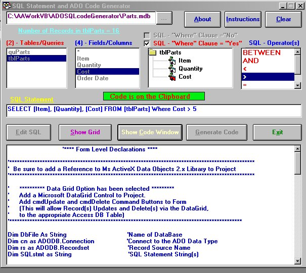

## ADOSQLcodeGenerator

### Description

This Program generates ADO code and SQL Statements without the use of

an ADO Data Control. It is available as a stand alone executable or as a VB-6.0 AddIn.
 
### More Info
 

             |
---                |---
**Submitted On**   |2000-10-25 09:45:40
**By**             |[John P\. Cunningham](https://github.com/Planet-Source-Code/PSCIndex/blob/master/ByAuthor/john-p-cunningham.md)
**Level**          |Intermediate
**User Rating**    |4.5 (49 globes from 11 users)
**Compatibility**  |VB 6\.0
**Category**       |[Databases/ Data Access/ DAO/ ADO](https://github.com/Planet-Source-Code/PSCIndex/blob/master/ByCategory/databases-data-access-dao-ado__1-6.md)
**World**          |[Visual Basic](https://github.com/Planet-Source-Code/PSCIndex/blob/master/ByWorld/visual-basic.md)
**Archive File**   |[CODE\_UPLOAD1097710262000\.zip](https://github.com/Planet-Source-Code/john-p-cunningham-adosqlcodegenerator__1-12316/archive/master.zip)

